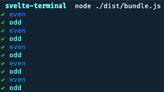

# Svelte in the terminal

This is an experiment to render Svelte in the terminal. It's very primitive but at least it gets something printed!

```svelte
<svelte:options customRenderer="./renderer.js" />

<internal-box>
	{#each new Array(10) as _, i}
		<internal-text color="cyan">
			<internal-text color="green">✔︎</internal-text>
			{#if i % 2 === 0}
				<internal-text color="blue">even</internal-text>
			{:else}
				odd
			{/if}
		</internal-text>
	{/each}
</internal-box>
```



## Installation

The code uses an experimental version of Svelte that supports custom renderers, by [MainMatter](https://github.com/mainmatter/svelte-lynx-integration).

```sh
# install dependencies
pnpm install
```

## Usage

```sh
# run App.svelte in the terminal
pnpm build && node ./dist/bundle.js
```
